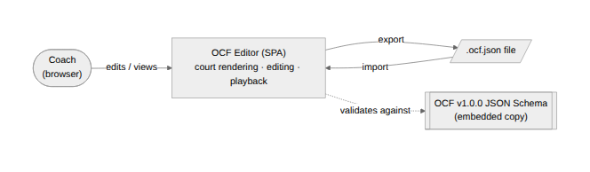
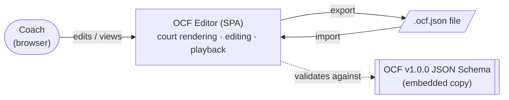
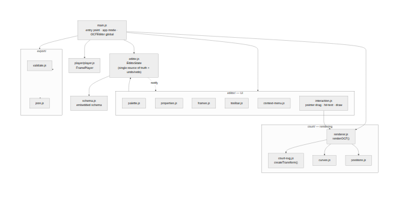
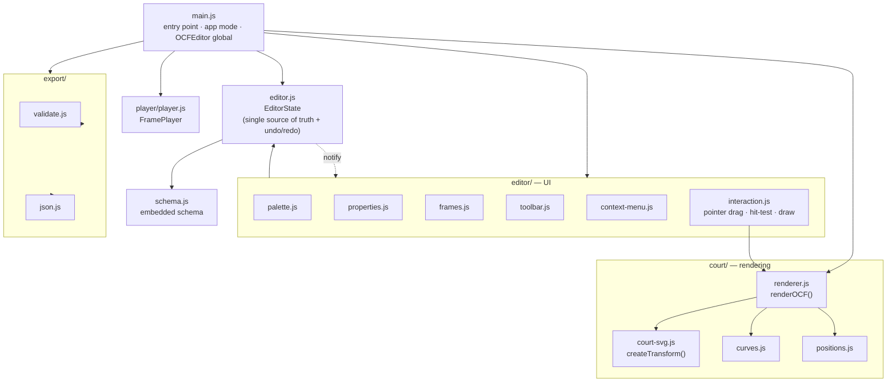
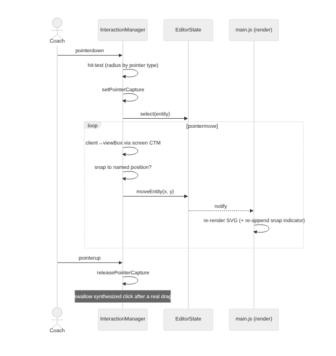
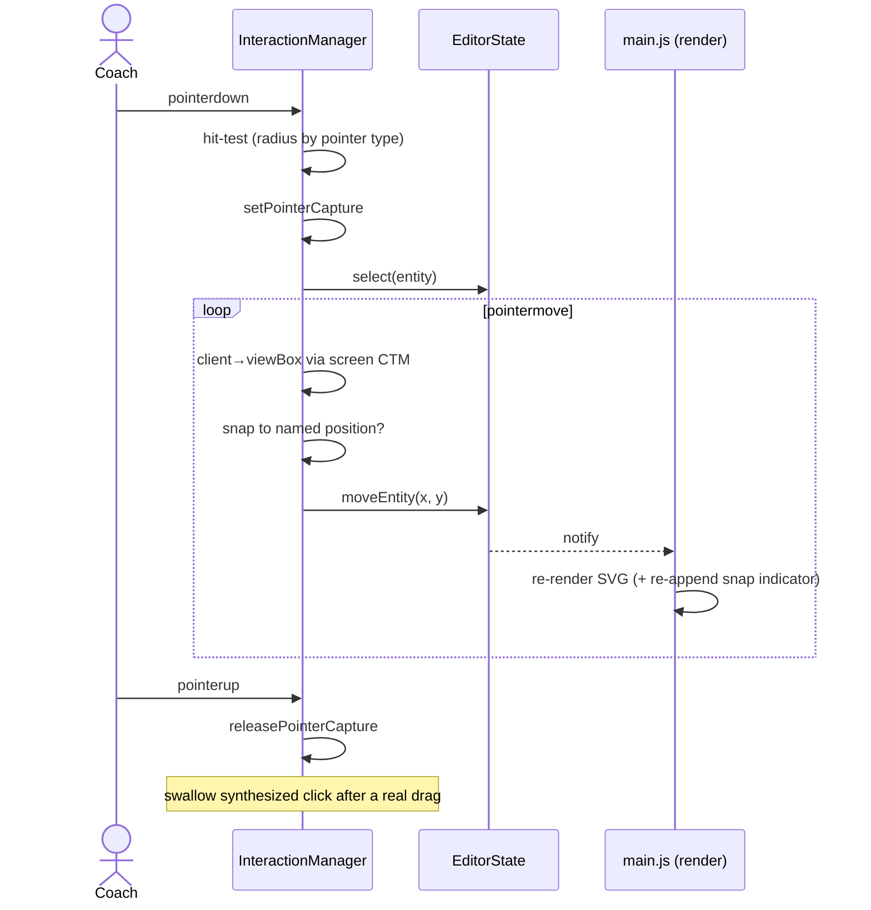
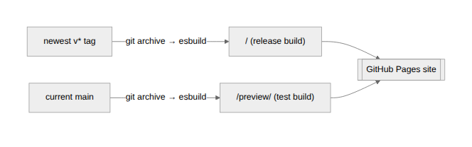
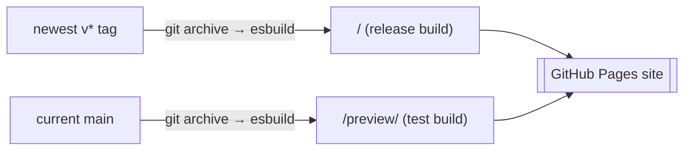
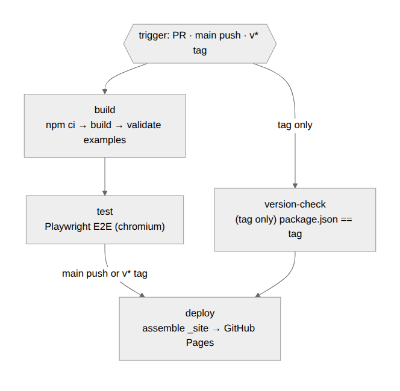
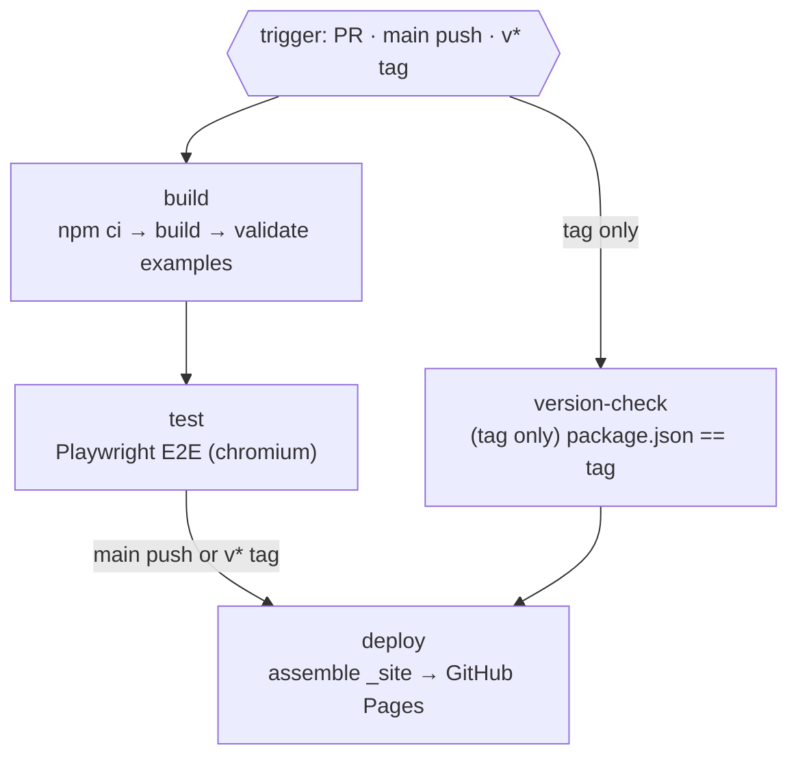

# OCF Editor — Architecture (arc42)

This document follows the [arc42](https://arc42.org/) template. It describes the
architecture of the OCF Editor, a reference web editor for the Open Coaching
Format (OCF) — an open JSON standard for basketball drill diagrams and
animations.

> Status: living document. Last substantive update reflects work up to and
> including the mobile-touch / rendering fixes and the release/preview CI
> pipeline (app version `0.2.1`).

---

## 1. Introduction and Goals

The OCF Editor lets coaches build basketball drills visually on a court, export
them as OCF-compliant `.ocf.json`, and play them back frame by frame. It is the
reference implementation of the OCF format.

### Requirements overview

- Visual half-court / full-court editor for FIBA, NBA, NCAA and NFHS courts.
- Place and drag entities: offense, defense, coach, cone, station, ball.
- Draw movement, passing, dribbling, screen and plain lines (straight or curved).
- Multi-frame drills using per-frame entity-state deltas.
- Live JSON view, import/export, and structural validation against OCF v1.0.0.
- A viewer mode that animates through frames.

### Quality goals

| # | Quality | Motivation |
|---|---------|------------|
| 1 | **Correctness of rendering** | Diagrams must read like standard coaching notation (court lines per ruleset, FIBA defender horseshoe, curve direction). |
| 2 | **Usability on touch devices** | Coaches use phones/tablets courtside; drag and draw must work with a finger. |
| 3 | **Portability / zero-backend** | Pure static site; deployable to GitHub Pages with relative asset paths. |
| 4 | **Format fidelity** | Output validates against the OCF schema. |
| 5 | **Testability** | Behaviour and geometry are covered by automated tests. |

### Stakeholders

- **Coaches** — end users authoring and viewing drills.
- **OCF maintainers** — own the spec; the editor is its reference UI.
- **Contributors** — extend rendering/interaction.

---

## 2. Architecture Constraints

- **No backend.** Everything runs in the browser; persistence is file
  import/export. The site must work as static files from any sub-path.
- **No runtime dependencies.** All `import`s are relative; the app is bundled
  with esbuild into a single IIFE (`ocf-bundle.js`). This is what lets CI build
  any git ref from a throwaY checkout (see §7).
- **Schema compatibility.** The embedded schema deviates from the published spec
  in two spots for `ajv` strict-mode compatibility (unknown `format` keywords);
  see the comment block atop `src/schema.js`.
- **Coordinate system.** Origin = midcourt center, `y+` = frontcourt (toward the
  offense basket). FIBA stores court coords in metres; NBA/NCAA/NFHS in feet.
- **Build tooling.** `esbuild` (bundling) and `@playwright/test` (E2E) are the
  only dev dependencies.

---

## 3. Context and Scope

Diagram source (Mermaid)

- **In scope:** the browser application, its rendering/editing/playback logic,
  the embedded schema and validator, examples, tests, and the CI/deploy pipeline.
- **Out of scope:** the OCF specification itself (lives in
  `opencoachingformat/spec`), any server, accounts, or cloud storage.

---

## 4. Solution Strategy

| Goal | Approach |
|------|----------|
| Correct rendering | A pure, side-effect-free renderer turns an OCF document + frame index into an SVG string. Geometry is unit-tested on the emitted path data. |
| Touch usability | A single **Pointer Events** code path (mouse + touch + pen), `touch-action: none` on the court, and a larger hit radius for coarse pointers. |
| Portability | Static files only; **relative** asset paths so the app runs from `/` or `/preview/`. |
| Format fidelity | A dependency-free structural validator plus CI validation of all examples. |
| Testability | Pure modules (renderer, curves, editor state) are tested directly; UI flows are driven through the real bundle via `window.OCFEditor`. |

---

## 5. Building Block View

Diagram source (Mermaid)

### Level 1 — modules (`src/`)

| Module | Responsibility |
|--------|----------------|
| `main.js` | Entry point. Wires UI components, owns app mode (editor/viewer) and the current transform. Exposes `editorState`, `player`, `getCurrentTransform()` on the `OCFEditor` global (used by tests). |
| `schema.js` | Embedded OCF v1.0.0 schema + `createBlankDocument()`. |
| `court/court-svg.js` | Court background per ruleset, and `createTransform()` (court coords ↔ viewBox coords). |
| `court/renderer.js` | `renderOCF(doc, frameIndex, w, h)` → `{ svgContent, transform }`. Resolves entity positions, draws entities/lines/areas/labels. |
| `court/curves.js` | Path geometry: `curvedPath`, `straightPath`, `dribblingPath`. |
| `court/positions.js` | Named positions per ruleset, coordinate resolution, snapping. |
| `editor/editor.js` | `EditorState`: the central store with undo/redo, entity/line/frame ops, tool state, ball assignment, `startLineTool`. |
| `editor/interaction.js` | `InteractionManager`: pointer drag, hit-testing, line drawing, snapping, keyboard. |
| `editor/context-menu.js` | Floating per-entity action menu (draw tools, ball, delete). |
| `editor/palette.js`, `properties.js`, `frames.js`, `toolbar.js` | Sidebar UI: add entities, edit properties, manage frames, keyboard shortcuts. |
| `player/player.js` | `FramePlayer`: frame navigation and timed playback. |
| `export/validate.js` | Dependency-free structural OCF validator. |
| `export/json.js` | JSON serialization + file import/export. |

### Level 2 — key abstractions

- **Pure renderer.** `renderOCF` has no DOM side effects; `main.js` assigns its
  string to `svg.innerHTML`. This makes rendering snapshot/geometry testable.
- **Single source of truth.** `EditorState` holds the document and notifies
  subscribers (`subscribe`/`notify`); UI components re-render on change.
- **Transform object.** `createTransform` returns `toSvg` / `toCourt` plus a
  scale helper, derived from the ruleset dimensions and padding.

---

## 6. Runtime View

### Editing an entity (drag)

Diagram source (Mermaid)

1. `pointerdown` on the court → `InteractionManager` hit-tests entities (radius
   depends on pointer type) and starts a drag, capturing the pointer.
2. `pointermove` → convert client → viewBox coords via the SVG **screen CTM**,
   apply optional snap to a named position, call `editorState.moveEntity`.
3. `EditorState` updates the base position (frame 0) or writes a frame
   `entity_states` delta (frame > 0) and notifies.
4. `main.js` re-renders the SVG; the snap indicator is re-appended (innerHTML
   reset detaches it).
5. `pointerup` releases capture; a synthesized click after a real drag is
   swallowed so it can't deselect.

### Drawing a line from a player

1. Player selected → context menu shown. A draw tool button calls
   `editorState.startLineTool(tool, key)`, which seeds the player's position as
   waypoint 1 and sets `from_entity`.
2. Court clicks append waypoints; double-click / Enter / ✓ commits the line into
   the current frame.

### Playback (viewer mode)

`FramePlayer.load(doc)` then `play()` schedules frame advances using each
frame's `duration_ms` (default 1500 ms), looping at the end; `onFrameChange`
re-renders.

---

## 7. Deployment View

Static site on **GitHub Pages**, assembled by `scripts/build-pages.sh`:

Diagram source (Mermaid)

- Both variants are rebuilt from their **own** git ref on every deploy
  (`git archive <ref>` → esbuild → copy static files → stamp version badge).
  This is possible only because the app has no runtime deps and uses relative
  asset paths.
- Until the first `v*` tag exists, the root mirrors the preview build.

### CI pipeline (`.github/workflows/ci.yml`)

Diagram source (Mermaid)

| Job | Runs on | Purpose |
|-----|---------|---------|
| `build` | PR, main push, tag push | `npm ci` → build → validate examples |
| `test` | needs `build` | Playwright E2E (chromium) |
| `version-check` | tag push only | `scripts/check-version.sh` fails unless `package.json` == tag |
| `deploy` | main push or `v*` tag, after build+test | assemble `_site` and publish to Pages |

### Release process

1. Bump `version` in `package.json` (single source — the build injects it into
   the badge and the E2E test derives it).
2. Merge to `main` (updates `/preview`).
3. `git tag vX.Y.Z && git push origin vX.Y.Z` → version-check gate → deploy to root.

> Note: the repo's *Settings → Pages → Source* must be **GitHub Actions** for the
> Actions-based deploy to take effect.

---

## 8. Cross-cutting Concepts

- **Coordinate transforms.** Court units ↔ viewBox via `createTransform`;
  client pixels ↔ viewBox via the SVG **screen CTM** (`getScreenCTM`). The court
  scales to 100% width, so client pixels never equal viewBox units — using the
  CTM is mandatory for correct hit-testing on any screen size.
- **Input.** Unified Pointer Events; `touch-action: none` prevents the browser
  from claiming finger drags as scroll/pan.
- **State & undo.** `EditorState` snapshots JSON for undo/redo and emits change
  notifications; the singleton is reset in tests for order-independence.
- **Validation.** Structural validator with no external deps; CI validates all
  `examples/*.ocf.json`.
- **Versioning.** The version lives solely in `package.json`. `scripts/build.js`
  injects it into the bundle at build time (esbuild `define` → `__APP_VERSION__`,
  read from `$npm_package_version`), `main.js` writes it into the badge, and the
  E2E test derives the expected value from `package.json`. The CI gate keeps a
  release tag consistent with `package.json`.

---

## 9. Architecture Decisions

| ADR | Decision | Rationale |
|-----|----------|-----------|
| Pure string renderer | `renderOCF` returns an SVG string, no DOM writes | Testable geometry; trivial re-render via `innerHTML`. |
| Pointer Events over mouse events | One handler path for mouse/touch/pen | Mouse-only handlers never fired for touch — entities couldn't be dragged on phones. |
| Screen-CTM coordinate mapping | Map client→viewBox via `getScreenCTM`, not `clientX - rect.left` | The 1:1 assumption was wrong whenever the SVG was scaled (always on mobile), mis-placing hits/drags. |
| Midpoint-quadratic curves | Interior waypoints are control points; spans join at segment midpoints | The old angle-bisector approach bowed curves *into* bends (wrong direction) and left half the line straight. |
| Stroked-arc defender | FIBA defender = single open stroked arc | The old filled self-intersecting Bézier collapsed into two crescents. |
| Possession via ball position | Ball ownership modeled by moving the ball entity onto a player | OCF has a single ball; no schema change, honors frame deltas. |
| Release/preview on one Pages site | Root = tag, `/preview` = main, rebuilt each deploy | Coexisting stable + test builds without a `gh-pages` branch. |

---

## 10. Quality Requirements

Automated tests (Playwright; pure modules tested without a browser):

| Suite | Focus |
|-------|-------|
| `tests/editor.spec.js` | App load, palette, settings, frames, undo/redo, JSON panel, viewer toggle, example import, version badge. |
| `tests/curves.spec.js` | Curve geometry: single quadratic with waypoint as control, apex on the same side as the waypoint, endpoints preserved; dribble waves alternate sides and follow bends. |
| `tests/renderer.spec.js` | Entity symbols (defender = open stroked arc), court surface/rim, line styling, and the half-court center-circle arc bulging into the court. |
| `tests/regressions.spec.js` | Ball possession, line selection/deletion, snap indicator persistence, right-click-selects, numbering cap, touch dragging (touch-action + generous radius), line-from-player. |

Practice: each bug fix ships with a test verified to **fail on the pre-fix code**
and pass after. Full suite at the time of writing: **51 tests**.

---

## 11. Risks and Technical Debt

- **Viewer/animation path** is the least test-covered area (frame deltas,
  playback timing) — next candidate for a rendered review + tests.
- **Court dimensions** are validated visually for plausibility, not numerically
  against rulebooks (deliberate — drills, not pixel-perfect designs).
- **Schema deviations** from the published spec exist for ajv strict mode; a
  drift risk if the spec changes (documented in `src/schema.js`).
- **Single-file bundle / global `OCFEditor`** is convenient for tests but is a
  global; acceptable for a small reference app.
- **External fonts** (Google Fonts) are loaded from a CDN; offline/blocked
  networks fall back to system fonts (cosmetic only).

---

## 12. Glossary

| Term | Meaning |
|------|---------|
| OCF | Open Coaching Format — the JSON standard this editor targets. |
| Entity | A court object: offense, defense, coach, cone, station, ball. |
| Frame | One step of a drill; carries lines and entity-state deltas. |
| Entity-state delta | Per-frame position override for an entity, layered on the base. |
| Named position | A ruleset-specific court location (e.g. `top_of_the_key`) used for snapping/coordinates. |
| Transform | The mapping between court coordinates and SVG viewBox coordinates. |
| Preview build | The deployment of the current `main` at `/preview/`. |
| Release build | The deployment of the newest `v*` tag at the site root. |
